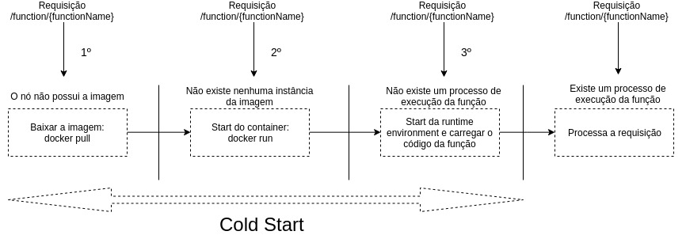

# Cold Start
No contexto de function-as-a-service (FaaS) o cenário ideal para o fluxo de processamento de uma requisição em uma plataforma de FaaS teria as seguintes premissas:

1. O **nó** possui a versão mais recente da imagem da função;
2. O **nó** possui um *container* da função em estado *running*;
3. No *container* da função em estado *running*, existe pelo menos um processo que pode responder à requisição realizada.

Com estas 3 premissas podemos especificar de maneira simples qual seria o melhor caso para o tratamento de uma requisição em uma plataforma de FaaS.

Contudo, é muito caro garantir que estas três premissas sempre serão satisfeitas ao longo do ciclo de vida do *deployment* de uma função, principalmente pelo fato das plataformas de FaaS utilizarem o modelo de *billing* *Pay-As-You-Go*, ou seja, quando a função não estiver sendo muito requisitada é provável que estas 3 premissas não serão garantidas objetivando a diminuição da utilização de recursos, e consequentemente, custos.

O ***Cold Start*** ocorre quando uma requisição é recebida no momento em que uma das premissas não é satisfeita sendo necessário realizar os procedimentos para satisfazê-la, o problema é que o tempo para realizar tais procedimentos pode ser custoso.

Suponha que a plataforma de FaaS utilize *Docker* para realizar o isolamento de aplicações, logo, para cada premissa, que vamos carinhosamente chamar de **etapa**, seria necessário de maneira resumida realizar tais procedimentos:

- **Etapa/Premissa 1**: ```docker pull``` - baixar a imagem *docker*.
- **Etapa/Premissa 2**: ```docker run``` - criar um *container*, uma instância de uma imagem *docker*.
- **Etapa/Premissa 3**: criar um processo com o código da função para processar a requisição.

Note que, as premissas são cumulativas, caso a premissa **1** não seja satisfeita as premissas **2** e **3** também não serão. Caso a premissa **2** não seja satisfeita a premissa **3** também não será.

É necessário notar que o momento, a maneira e quais premissas deixarão de ser satisfeitas dependerá da forma como a plataforma foi projetada. Utilizando o exemplo do [OpenFaas](https://docs.openfaas.com/) os cenários onde cada etapa pode ocorrer são:

- **Etapa 1**: quando não existe nenhum **nó** alocado para a função, pois, ficou muito tempo sem ser utilizada.
- **Etapa 2**: quando no **nó** não existe nenhum *container* em estado *running*.
- **Etapa 3**: quando no *container* não existe nenhum processo pronto para processar a requisição.

Na prática, no OpenFaaS, uma requisição pode chegar no momento em que não faz a premissa 1 ou a premissa 3. A figura abaixo ilustra o fluxo de processamento de uma requisição para cada etapa no OpenFaaS.


